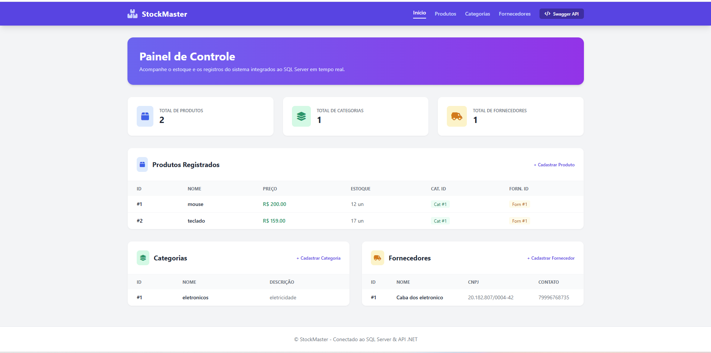
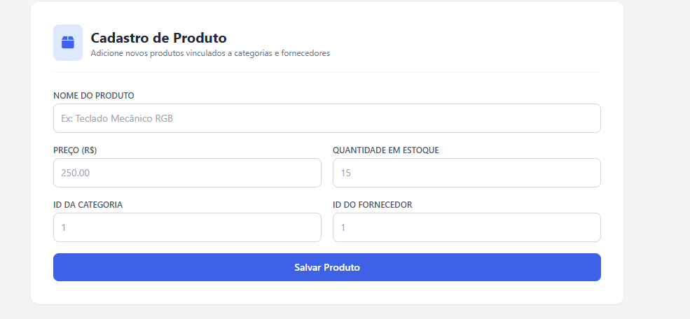

# ControleEstoque (StockMaster)

Sistema de gerenciamento de estoque para controle de **Produtos**, **Categorias** e **Fornecedores**. O projeto conta com uma **Web API RESTful** desenvolvida em ASP.NET Core no backend e uma interface web moderna e responsiva em **HTML, CSS e JavaScript** no frontend.

---

## 🛠️ Tecnologias Utilizadas

### Backend
- **C#** / **.NET**
- **ASP.NET Core Web API**
- **Entity Framework Core**
- **SQL Server**

### Frontend
- **HTML5** & **CSS3**
- **JavaScript (ES6+)** utilizando `Fetch API` para consumo assíncrono

### Ferramentas & Ambiente
- **Visual Studio Code (VS Code)**
- **Git** & **GitHub**

---

## 📦 Pacotes NuGet Utilizados

- `Microsoft.EntityFrameworkCore.SqlServer`
- `Microsoft.EntityFrameworkCore.Tools`
- `Microsoft.EntityFrameworkCore.Design`

---

## 🗄️ Banco de Dados & Engenharia Reversa (Scaffold)

O banco de dados foi modelado diretamente no **SQL Server**. Para a integração com o Entity Framework Core no C#, foi utilizada a abordagem **Database First** através de **Engenharia Reversa (Scaffold)**, gerando automaticamente os modelos (`Models`) e o contexto (`DbContext`):

```bash
✨ Funcionalidades
Dashboard / Início:

Carregamento dinâmico do quantitativo de Produtos, Categorias e Fornecedores cadastrados via endpoints GET.

Gerenciamento de Categorias:

Listagem e cadastro de novas categorias de produtos.

Gerenciamento de Fornecedores:

Listagem e cadastro de fornecedores (Nome, CNPJ, Contato/Email).

Gerenciamento de Produtos:

Cadastro e listagem de produtos com vínculos diretos a Categorias e Fornecedores (CategoriaId e FornecedorId).
```
📸 Interface do Sistema
Dashboard Principal:

Cadastro de Produtos:

🚀 Como Executar o Projeto
Pré-requisitos
  .NET SDK instalado.

  VS Code com a extensão C# Dev Kit (opcional, mas recomendado).

  Servidor SQL Server em execução.

###Passo a Passo
Obter os arquivos

Caso tenha o arquivo .zip: Extraia o conteúdo da pasta zipada em um diretório de sua preferência.

Ou via Git:
git clone [https://github.com/SeuUsuario/ControleEstoque.git](https://github.com/SeuUsuario/ControleEstoque.git)

Abrir no VS Code
Acesse a pasta do projeto no terminal e execute:
```
code .
```
Configurar a Conexão com o Banco
Abra o arquivo appsettings.json na raiz da API e ajuste a ConnectionString para apontar para o seu servidor SQL Server:
```
"ConnectionStrings": {
  "ConexaoPadrao": "Server=SEU_SERVIDOR;Database=ControleEstoque;Trusted_Connection=True;TrustServerCertificate=True;"
}
```
Executar a Web API
No terminal integrado do VS Code, execute:
```
dotnet run
```
Executar o Frontend

Abra o arquivo index.html diretamente no seu navegador OU utilize a extensão Live Server do VS Code para rodar a aplicação web.
```
📁 Estrutura do Projeto
ControleEstoque
 ├── Controllers/          # Endpoints da Web API (Produtos, Categorias, Fornecedores)
 ├── Models/               # Classes geradas via Engenharia Reversa (Scaffold)
 ├── Data/                 # DbContext do Entity Framework Core
 ├── wwwroot/              # Arquivos do Frontend
 │    ├── index.html       # Painel Principal
 │    ├── produtos.html    # Tela de Produtos
 │    ├── app.js           # Lógica JavaScript (Fetch API)
 │    └── style.css        # Estilização do sistema
 ├── appsettings.json      # Configurações de Conexão e API
 └── Program.cs            # Configurações de Injeção de Dependência, CORS e Middlewares
```
# Desenvolvido com
- **ASP.NET Core Web API**
- **C#**
- **Entity Framework Core** (Database First / Scaffold)
- **SQL Server**
- **HTML5, CSS3 e JavaScript** (Fetch API)
- **Visual Studio Code**

# Autores

### Desenvolvedor

**Gabriel Silva de Almeida Ferreira**

### Professor

**Wallace Oliveira dos Santos**
